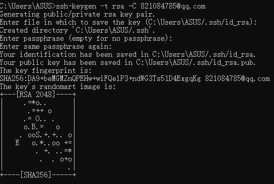
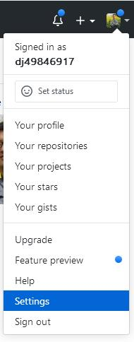
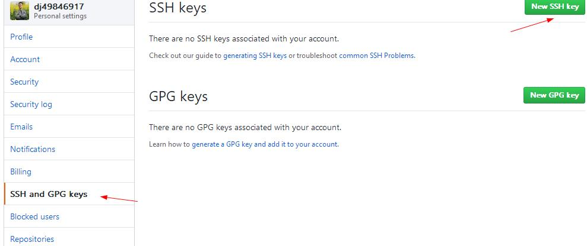
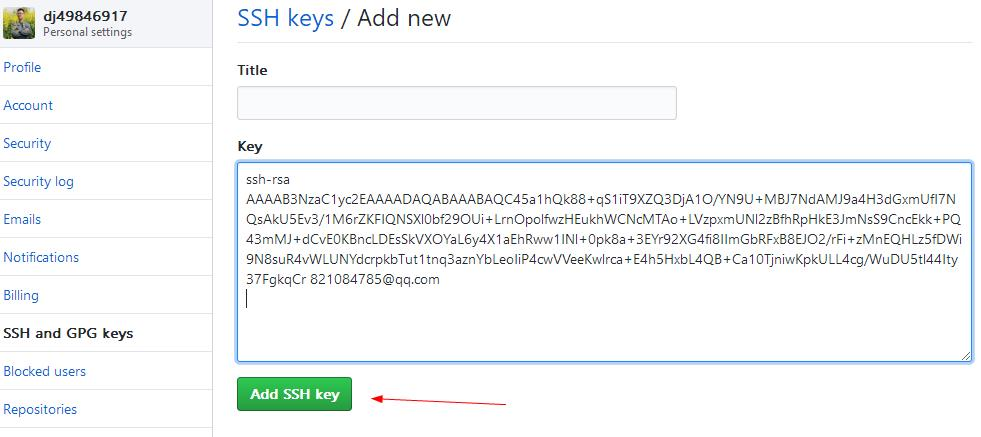

# github + hexo搭建博客

# 环境搭建
1. 新建github仓库
  
2. 安装node.js
   
3. 安装git
     * 安装完git之后，注册用户名和邮箱
     * 获取ssh-key（目的是推送时不用输入账号密码）
       ```
           # 在控制台输入:
           git config --global user.name dj49846917
           git config --global user.email 821084785@qq.com

           # 获取ssh-key
           ssh-keygen -t rsa -C 821084785@qq.com

           # 在github绑定ssh-key之后，输入命令测试key是否有效
           ssh git@github.com
       ```

     * 
     * 
     * 
     * 
     * 
     * 
     * 

4. 安装hexo
  ```
    cnpm install -g hexo-cli -g
  ```

5. 将hexo发布到github
  ```
    # 安装hexo-deployer-git的包
      cnpm install hexo-deployer-git --save

    # 找到_config.yml，添加以下内容
      deploy:
        type: 'git'
        repo: 'https://github.com/dj49846917/blog.git',
        branch: master
  ```

6. hexo常见命令
   * hexo clean（清除缓存）
   * hexo douban(安装了hexo-douban的，生成数据) 
   * hexo g（生成对应的文件）
   * hexo deploy（发布）

# 注意： 在部署github时，项目名称最好是：dj49846917/github.io,因为展示是master分支，而不是gh-pages，所以，不这样设置项目名称，打开github pages就会报404

# 如何添加页面
   * hexo new page

# 如何添加文章
   * hexo new post

